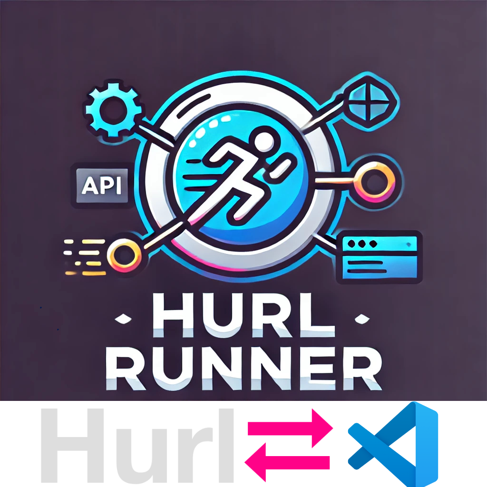

  

<h1 align="center">Welcome to vscode-hurl-runner 👋</h1>

  
  
  
  
  

> Streamline API development in VSCode. Run Hurl requests, manage variables, and view responses directly in your editor.

### 🏠 [Homepage](https://github.com/jellydn/vscode-hurl-runner#readme)

## Prerequisites

- vscode ^1.92.0
- [Hurl - Run and Test HTTP Requests](https://hurl.dev/)

## Features

- Run Hurl requests directly from VSCode
- Execute single entries or entire Hurl files
- Manage environment variables for Hurl requests
- Support for inline variables
- View detailed HTTP responses in a formatted webview
- Syntax highlighting for Hurl files
- Integration with VSCode's status bar for execution feedback

### Commands

<!-- commands -->

| Command                                    | Title                         |
| ------------------------------------------ | ----------------------------- |
| `vscode-hurl-runner.runHurl`               | Hurl: Run at entry            |
| `vscode-hurl-runner.runHurlFile`           | Hurl: Run File                |
| `vscode-hurl-runner.runHurlToEnd`          | Hurl: Run to End              |
| `vscode-hurl-runner.manageInlineVariables` | Hurl: Manage Inline Variables |
| `vscode-hurl-runner.selectEnvFile`         | Hurl: Select Environment File |

<!-- commands -->

### Configs

<!-- configs -->

| Key                                       | Description                                                                                                                                                                         | Type     | Default     |
| ----------------------------------------- | ----------------------------------------------------------------------------------------------------------------------------------------------------------------------------------- | -------- | ----------- |
| `vscode-hurl-runner.hurlPath`             | Path to the Hurl executable                                                                                                                                                         | `string` | `"hurl"`    |
| `vscode-hurl-runner.environmentVariables` | Environment variables to be used when running Hurl files                                                                                                                            | `object` | `{}`        |
| `vscode-hurl-runner.verboseMode`          | Set the verbosity level for Hurl execution. 'verbose' provides basic information about requests and responses. 'very-verbose' includes detailed information, including timing data. | `string` | `"verbose"` |

<!-- configs -->

### Keybindings

- `ctrl+alt+h` (Windows/Linux) or `cmd+alt+h` (Mac): Run Hurl entry
- `ctrl+alt+f` (Windows/Linux) or `cmd+alt+f` (Mac): Run Hurl file
- `ctrl+alt+shift+v` (Windows/Linux) or `cmd+alt+shift+v` (Mac): Manage variables

## Demo

- Running a single Hurl entry
  

- Running from entry to the end of file
  

- Running an entire Hurl file
  

- Manage variables
  

- Select env file
  

## Related Projects

### For Neovim Users

If you prefer Neovim, check out my companion plugin:

- [hurl.nvim](https://github.com/jellydn/hurl.nvim): A Neovim plugin for running Hurl requests directly within Neovim.

This plugin offers similar functionality to this VSCode extension, tailored for the Neovim environment.

### Other Tools in the Ecosystem

- [pfeiferj/vscode-hurl](https://github.com/pfeiferj/vscode-hurl)
- [Verseth/vscode-hurl-runner](https://github.com/Verseth/vscode-hurl-runner)

Whether you're using VSCode, Neovim, or the command line, there's a tool to help you work efficiently with Hurl files.

# Author

👤 **Dung Huynh Duc <dung@productsway.com>**

- Website: https://productsway.com/
- Github: [@jellydn](https://github.com/jellydn)

## 🤝 Contributing

Contributions, issues and feature requests are welcome! Feel free to check [issues page](https://github.com/jellydn/vscode-hurl-runner/issues). You can also take a look at the [contributing guide](https://github.com/jellydn/vscode-hurl-runner/blob/master/CONTRIBUTING.md).

## Show your support

Give a ⭐️ if this project helped you!

## 📝 License

Copyright © 2024 [Dung Huynh Duc <dung@productsway.com>](https://github.com/jellydn). 
This project is [MIT](https://github.com/jellydn/vscode-hurl-runner/blob/master/LICENSE) licensed.

